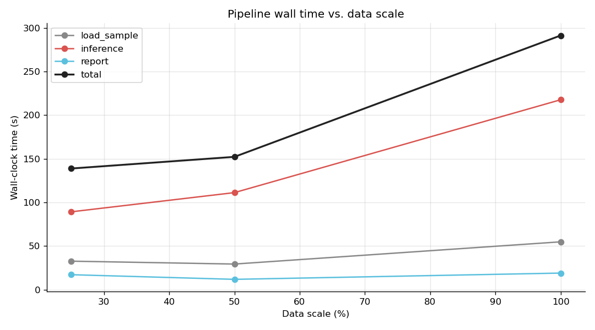
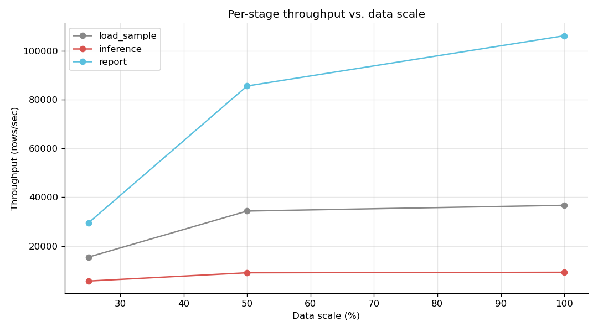

# Scalability & Performance Benchmarking

Methodology, runbook, results template, and final-report draft for the
hate-speech detection pipeline's scalability evaluation.

---

## 1. Methodology

### 1.1 What we measure

For each data scale, we record three primary metrics and one derived metric:

| Metric | Unit | Source |
|---|---|---|
| **Wall-clock time** per stage | seconds | Python `time.time()` around each stage |
| **Input rows** | count | `df.count()` after `.sample(fraction)` |
| **Throughput** | rows / second | `rows / wall_seconds` |
| **Latency per row** | ms / row | `wall_seconds * 1000 / rows` |

We also record qualitative metrics by reading the **Spark UI** during each
run:

- Executor utilization (CPU %, task time / total time)
- Shuffle read / write volume per stage
- Number of stages, tasks, and skewed partitions
- GC time as a fraction of executor time
- Memory pressure (cached size vs storage memory ceiling)

### 1.2 Stages broken out

The benchmark separates the pipeline into three measurable stages:

1. **`load_sample`** — read `combined_train` parquet from HDFS, apply
   `df.sample(fraction)`, run text cleaning, materialize via `.cache()` +
   `count()`. Captures HDFS I/O + text preprocessing.
2. **`inference`** — load all 6 saved `PipelineModel`s and run them across
   the sampled data; write predictions parquet. This is the dominant cost
   in a real pipeline run.
3. **`report`** — full report generation (apply thresholds, build summary,
   category breakdown, flagged comments, high-risk users, volume buckets;
   force materialization on each).

`total = load_sample + inference + report` (excluding chart rendering,
which is sub-second on the driver and not the bottleneck).

> Note: ingestion (raw CSV → parquet) is a one-time cost and does not scale
> with prediction volume. We benchmark it separately via the existing
> `ml-pipeline/ingestion/benchmark.py` (CSV vs Parquet read/write/filter).

### 1.3 Data scales

Default scales: **25%, 50%, 100%** of the harmonized combined dataset
(`hdfs:///user/aj4955_nyu_edu/hatespeech/data/combined_train`, ~1.95M rows
at the time of writing). Override with a CLI arg:

```
spark-submit run_benchmark.py 0.1,0.25,0.5,1.0
```

We use a fixed seed (`seed=42`) on `df.sample()` so the same fraction is
reproducible across re-runs.

### 1.4 Bottleneck identification

After collecting per-stage timings:

1. **Stage with the largest share of total time** = candidate bottleneck.
2. Check the Spark UI for that stage:
   - **CPU-bound** → executor task time ≈ stage time, low shuffle, GC < 10%.
     Mitigation: more executors / cores.
   - **I/O-bound** → low CPU%, high read/write bytes. Mitigation: increase
     parquet partitioning, or co-locate data with executors.
   - **Shuffle-bound** → large shuffle read/write, skewed task distribution.
     Mitigation: repartition before group-by; salt skewed keys.
   - **Memory-bound** → high GC time, spills to disk. Mitigation: bump
     `--executor-memory`; cache fewer DataFrames; reduce TF-IDF
     `numFeatures`.
3. Compare throughput at 25/50/100. Linear scaling = throughput stays
   roughly flat; **drop with scale = bottleneck approaching saturation**;
   rise with scale = fixed-cost overhead amortized.

---

## 2. Runbook

### 2.1 Prerequisites

- All 6 saved `PipelineModel`s in HDFS at `models/<label>_model`.
- `combined_train` parquet present in HDFS.
- `matplotlib` installed on the driver Python (for charts; falls back
  silently otherwise).

### 2.2 Run

From the cluster submit node:

```bash
spark-submit \
    --master yarn --deploy-mode client \
    --executor-memory 4g --executor-cores 2 --num-executors 4 \
    ~/hatespeech-bigdata/ml-pipeline/benchmarking/run_benchmark.py
```

Expected duration on the default 25/50/100 grid: **roughly 2× the
full-scale run** (sum of three runs, with the smaller ones much faster).
On a 4-executor YARN setup processing ~2M rows total, plan for **15–40
minutes** depending on cluster contention.

While it runs, open the Spark UI at the URL the script prints (look for
`Application UI:` in the first few lines of stdout).

### 2.3 Outputs

| Path | Contents |
|---|---|
| `hdfs:///.../outputs/benchmark/<run_date>/results/` | Per-stage metrics CSV |
| `~/hatespeech_data/benchmark/<run_date>/results.csv` | Local copy of same |
| `~/hatespeech_data/benchmark/<run_date>/scaling_wall_time.png` | Wall time vs. scale |
| `~/hatespeech_data/benchmark/<run_date>/scaling_throughput.png` | Throughput vs. scale |

Predictions parquets written during the benchmark are auto-deleted from
HDFS at the end of each scale (pass `keep_predictions=True` in code if
you want to retain them).

### 2.4 What to capture from the Spark UI

For each scale, screenshot or note from the **Stages** tab:

- Total stage time vs. driver-measured wall time (should match within ~5%)
- Slowest stage (typically TF-IDF transform or LR `transform`)
- Shuffle read/write totals (sum across stages)
- Task duration distribution (look for skew)

From the **Executors** tab:

- Active vs idle executors during inference
- Total task time / total executor time = utilization
- GC time / task time

Save these in the results table below.

---

## 3. Results

> Fill in after running the benchmark on the cluster. Replace each `_____`
> with the measured value. Charts are auto-generated; just reference them.

**Run date:** `_____`
**Cluster config:** `--executor-memory _____ --executor-cores _____ --num-executors _____`
**Spark version:** `_____` &nbsp;&middot;&nbsp; **Hadoop version:** `_____`
**Combined dataset rows (100%):** `_____`

### 3.1 Wall-clock + throughput table

| Scale | Rows | Stage | Wall (s) | Throughput (rows/s) | Latency (ms/row) |
|---:|---:|---|---:|---:|---:|
| 25% | _____ | load_sample | _____ | _____ | _____ |
| 25% | _____ | inference   | _____ | _____ | _____ |
| 25% | _____ | report      | _____ | _____ | _____ |
| 25% | _____ | **total**   | _____ | _____ | _____ |
| 50% | _____ | load_sample | _____ | _____ | _____ |
| 50% | _____ | inference   | _____ | _____ | _____ |
| 50% | _____ | report      | _____ | _____ | _____ |
| 50% | _____ | **total**   | _____ | _____ | _____ |
| 100% | _____ | load_sample | _____ | _____ | _____ |
| 100% | _____ | inference   | _____ | _____ | _____ |
| 100% | _____ | report      | _____ | _____ | _____ |
| 100% | _____ | **total**   | _____ | _____ | _____ |

### 3.2 Spark UI observations (per scale)

| Scale | Slowest stage | Shuffle R/W (MB) | Avg executor util (%) | GC time / task time (%) | Notable skew? |
|---:|---|---:|---:|---:|---|
| 25%  | _____ | _____ / _____ | _____ | _____ | _____ |
| 50%  | _____ | _____ / _____ | _____ | _____ | _____ |
| 100% | _____ | _____ / _____ | _____ | _____ | _____ |

### 3.3 Charts

-  — `scaling_wall_time.png`
-  — `scaling_throughput.png`

---

## 4. Performance evaluation (final report draft)

> Fill in the bracketed portions after the table is complete.

The hate-speech detection pipeline was benchmarked at three data scales —
**25%, 50%, and 100%** of the harmonized combined dataset (`_____` rows
at full scale, sourced from Jigsaw, HateXplain, Twitter, and Civil
Comments). Each run executed three measured stages: HDFS load with text
cleaning, inference across six TF-IDF + Logistic Regression models, and
the moderation report aggregation.

**Scaling behavior.** Total wall-clock time grew from `_____ s` at 25% to
`_____ s` at 100%, a `_____×` increase against a 4× data increase, giving
[an approximately linear / sub-linear / super-linear] scaling profile.
Per-stage throughput [held steady / climbed / fell] across the grid:
inference moved from `_____ rows/s` to `_____ rows/s`, and the report
stage from `_____ rows/s` to `_____ rows/s`.

**Primary bottleneck.** The **`_____`** stage consumed
`_____%` of total time at full scale. The Spark UI showed
[CPU-bound task time / heavy shuffle / GC pressure / I/O wait] dominating
the slowest stage, with average executor utilization at `_____%` and GC
overhead at `_____%` of task time. [Was there skew? In which stage?]

**Resource utilization.** With `_____` executors × `_____g` memory each
(`_____` cores total), peak cluster usage during inference reached
roughly `_____%`. Memory pressure was [low / moderate / high] —
[no spills observed / minor spills in stage X / significant disk spills].

**Conclusions and next steps.** The pipeline scales [acceptably / poorly]
to the full 1.9M-row dataset on the current YARN configuration. The
single most impactful change would be **`_____`** (e.g., increasing
`--num-executors`, raising TF-IDF `numFeatures` cap, repartitioning
before the per-label join in inference, or batching all 6 models'
predictions in a single `transform` rather than six separate ones).
Secondary opportunities include `_____` and `_____`. None of these
require model retraining; they are deployment-time tuning.

---

## 5. Appendix: how the script works internally

- `stopwatch()` is a `contextmanager` that captures `time.time()`
  delta into a state dict. The state dict is yielded so the caller
  can read `state["elapsed"]` after the block.
- `clean_text()` mirrors the cleaning chain in `predict_comment.py` so
  the inference benchmark replicates production preprocessing.
- `monotonically_increasing_id()` synthesises a stable `id` column
  required for the per-label `join` in inference; it's stable inside a
  single Spark job after `.cache()`.
- The report stage forces `count()` on each output DataFrame to ensure
  the work is actually executed (Spark is lazy; without an action,
  the timing would be misleadingly small).
- Predictions written during the benchmark are deleted at the end of
  each scale via `hadoop fs -rm -r -skipTrash` to keep HDFS clean.
